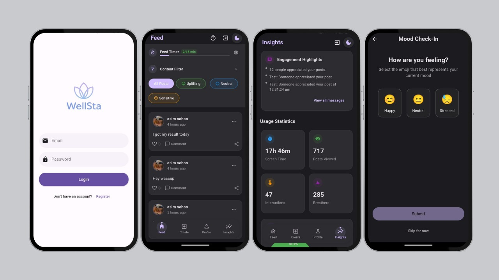
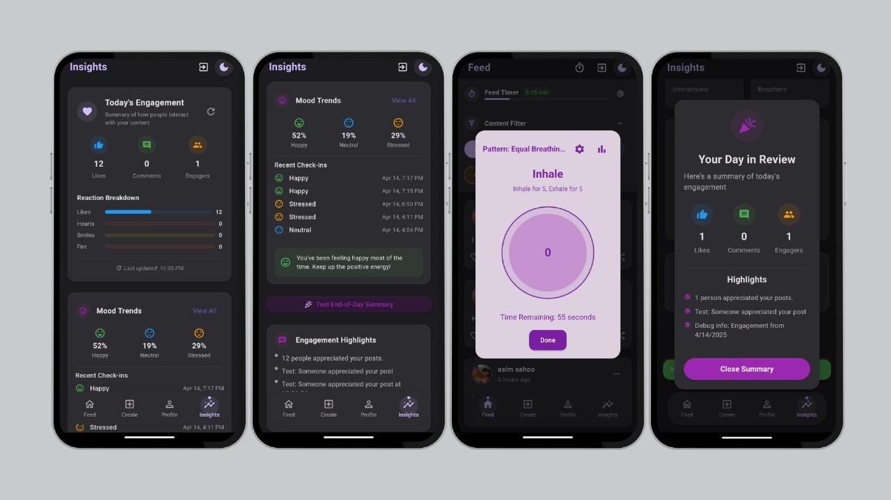
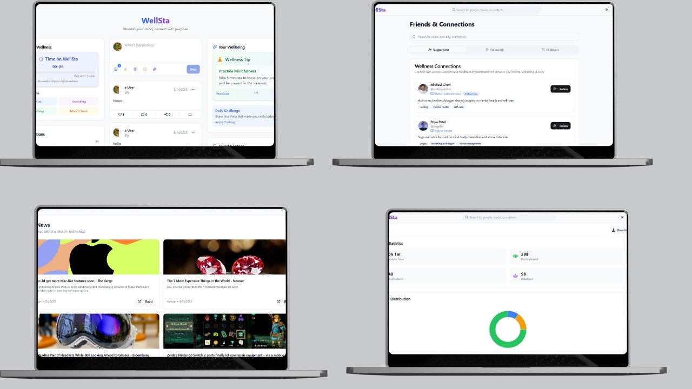

# GSoC Innovators Club - Summer of CodeFest'25

# 🧠 Healthy Social Media - Wel

A wellness-focused social media platform designed to promote mindful digital interaction and mental well-being. Built with modern technologies for both web and mobile platforms, Healthy Social Media encourages users to take control of their screen time, focus on meaningful engagement, and reduce digital fatigue.

---

## 🌐 Overview

This project includes two distinct platforms:

- *Mobile App* – Built using Flutter with a Node.js backend.
- *Web Platform* – Developed with the MERN stack (MongoDB, Express.js, React, Node.js) and styled using Tailwind CSS.

Both platforms are integrated to offer a unified and health-conscious social media experience.

---

## 🌍 Live Website

- *Web App (React + Node.js):* [https://wellsta.onrender.com](https://wellsta.onrender.com)

---

## 📲 Try the App

- *APK Download:* [Download APK](./app-release.apk)
- *Live Preview (Appetize.io):* [Click here to try the app online](https://appetize.io/app/b_yojgh53qzhtrzqqs2jzoqrdxa4)

---
---

## PPT Link

- *Drive Link:* [https://drive.google.com/file/d/1NDtfVL_TuZ7PfPZjjNKFc5ogseRBYMoI/view?usp=drivesdk]

---
## 📸 Screenshots

Here are some screenshots of the application in action:





---

## ✨ Key Features

### 📱 Mobile App (Flutter + Node.js)
- *Focus Mode (Breather Mode):* Encourages users to take mindful breaks from social media.
- *Download Report:* Allows users to download a summary of their app usage patterns.
- *Dark/Light Mode:* Theme switcher for better user experience and eye comfort.
- *Secure Backend:* Built using Node.js and Express, connected with MongoDB for storing user data securely.
- *Filter Posts by Mood:* Users can filter the feed to view posts that match their current mood, promoting a more personalized and supportive experience.
- *Engagement Summary:* Instead of traditional like counts, the app displays a summary of overall engagement at the end of the day, giving users a comprehensive view of their interactions.
- *Mood Analytics Dashboard:* Analyzes mood trends after breather sessions, showing:
  - Screen time
  - Posts viewed
  - Interactions (likes, comments, etc.)
  - Number of breather sessions taken
  - A pie chart visualization of these stats

### 💻 Web Platform (MERN + Tailwind CSS)
- *Journalist Mode:* Users can write and post long-form content or journals.
- *Downloadable Usage Reports:* Just like the app, users can download reports of their time spent and interactions.
- *Focus Mode:* Dedicated breathing and focus UI components for distraction-free interaction.
- *Responsive UI:* Built using Tailwind CSS for seamless experience across devices.
- *Dark/Light Theme Toggle:* Enables users to switch themes based on their preference.

---

## ⚙ Tech Stack

### Mobile App
- *Frontend:* Flutter
- *Backend:* Node.js, Express
- *Database:* MongoDB

### Web Platform
- *Frontend:* React.js, Tailwind CSS
- *Backend:* Node.js, Express
- *Database:* MongoDB

---

## 🧪 How to Run Locally

### Web

```bash
cd web/server
npm install
npm run dev   # Starts Node.js backend

cd ../client
npm install
npm start     # Starts React frontend